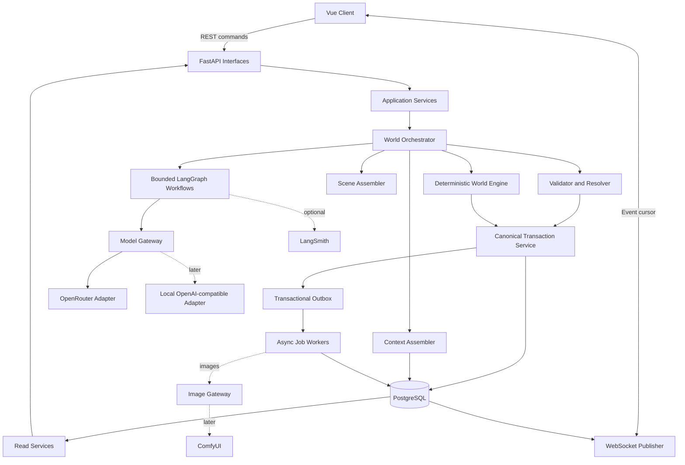
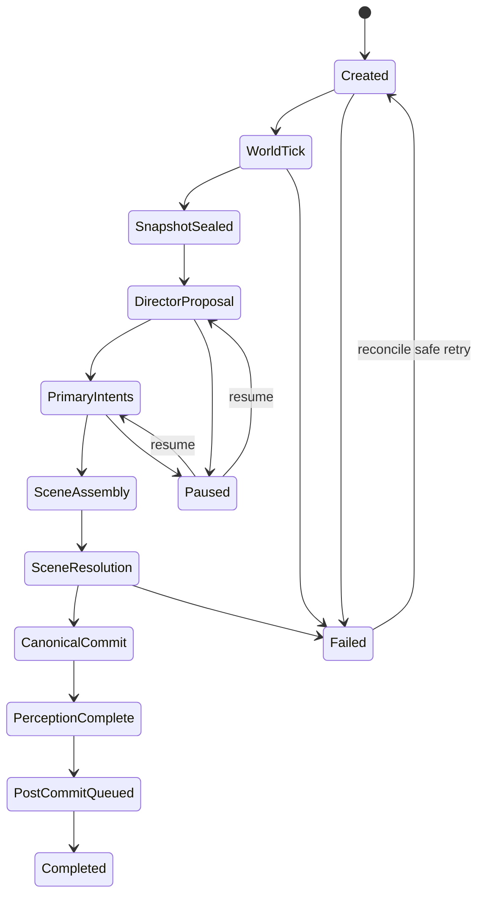

# System and Repository Architecture

**Status:** Normative technical architecture

## 1. Objective

Permit creative model behavior without allowing probabilistic output to mutate canonical world state. Support long-running simulation, perspective isolation, restart safety, user intervention, provider replacement, and a visual-novel presentation without premature distribution.

## 2. Architectural planes

```text
Creative proposal plane
  CharacterDecisionGraph, DirectorProposalGraph, ResolutionGraph,
  NarrationGraph, MemoryConsolidationGraph, image prompt composer

Deterministic authority plane
  World Engine, permissions, validators, scene assembler,
  hybrid resolver rules, canonical transaction service

Persistence plane
  PostgreSQL, pgvector extension, event/effect history,
  projections, task/outbox state, graph checkpoints, asset metadata

Presentation plane
  FastAPI commands/read models, WebSocket event publisher,
  Vue visual-novel client, timeline, map, encyclopedia, diary, gallery

Execution plane
  One process initially; database-backed task workers;
  later local model servers, ComfyUI, and optional Temporal adapter
```

## 3. Top-level component flow



## 4. Layered repository layout

```text
backend/
  pyproject.toml
  alembic.ini
  migrations/
  src/worldsim/
    domain/
      ids.py
      enums.py
      errors.py
      time.py
      commands.py
      effects.py
      events.py
      world/
      characters/
      scenes/
      activities/
      rules/
      memory/
    application/
      ports/
      unit_of_work.py
      commands/
      queries/
      orchestration/
      context/
      perception/
      resolution/
      transactions/
      projectors/
    agents/
      state.py
      prompts/
      character_decision/
      director/
      resolution/
      narration/
      memory/
    infrastructure/
      db/
      repositories/
      models/
      langgraph/
      model_gateway/
      image_gateway/
      tasks/
      telemetry/
      settings.py
    interfaces/
      api/
      websocket/
      cli/
      dto/
  tests/
    unit/
    integration/
    architecture/
    scenarios/
    fixtures/

frontend/
  package.json
  src/
    api/
    components/
    features/
      timeline/
      visual-novel/
      characters/
      map/
      encyclopedia/
      diary/
      operations/
      settings/
    routes/
    stores/
    styles/
    assets/
  tests/

content/
  seeds/
  schemas/
  prompts/
  evaluations/

scripts/
  generate-openapi-client
  verify-migrations
  run-stage-scenario

docs/generated/
  openapi.json
  json-schema/
  database-schema/
  stage-evidence/
```

Generated outputs may use different paths if tooling requires them, but ownership and dependency direction must remain unchanged.

## 5. Dependency direction

```text
interfaces ───────┐
agents ───────────┼──> application ───> domain
infrastructure ───┘
```

Rules:

- `domain` imports only the standard library and explicitly approved validation primitives.
- `application` imports domain types and abstract ports.
- `agents` imports domain contracts, application ports, LangChain, and LangGraph.
- `infrastructure` implements persistence, providers, workers, and telemetry ports.
- `interfaces` translates HTTP, WebSocket, and CLI boundaries into application commands and queries.
- ORM models never cross repository boundaries.
- API DTOs are not domain entities.
- Frontend types are generated from OpenAPI, not hand-maintained mirrors.

## 6. Component responsibilities

### FastAPI interfaces

Own HTTP validation, authentication/role checks at the boundary, stable error translation, idempotency headers, health endpoints, and event-cursor endpoints. They do not implement simulation rules or call models directly.

### World Orchestrator

Owns the phase state machine, dependency barriers, task creation, budget reservation, pause boundaries, restart reconciliation, and orchestration of deterministic and model work. It does not own domain rule calculations or database details.

### Deterministic World Engine

Owns clock advancement, scheduled effects, travel/activity progress, recovery, resource regeneration, weather/environment updates, interruption checks, deterministic encounter candidates, and end-condition checks. It has no model dependency.

### Context Assembler

Creates one immutable role- and perspective-safe context envelope and source manifest per model call. It enforces scope before retrieval and prompt rendering.

### Bounded agent graphs

Generate structured proposals or noncanonical presentation. They cannot commit canon, receive unrestricted repositories, or act as the global scheduler.

### Scene Assembler

Groups intents through explicit targets, locations, shared resources, routes, appointments, events, and causal conflict. It identifies disjoint scenes eligible for parallel resolution.

### Validator and Hybrid Resolver

Validates schema, permission, knowledge, capability, location, resources, target state, and expected versions. It resolves deterministic cases directly and requests bounded model judgment only where ambiguity remains.

### Canonical Transaction Service

Is the only normal writer of event-driven world changes. It version-checks aggregates, inserts event/effects, updates projections, creates observations/immediate memories, writes outbox records, and commits once.

### Perception Service

Calculates eligible observers and permitted fact sets from participation, location, senses, communication, and concealment. Optional model phrasing may not expand the allowed facts.

### Read Services and Projectors

Expose efficient omniscient, character-scoped, player-scoped, timeline, map, diary, and encyclopedia projections. Presentation prose never becomes a source for canonical reconstruction.

### Task and outbox workers

Claim durable work using leases, heartbeat long work, retry boundedly, and write idempotent results. Images, embeddings, projections, and evaluations use separate task kinds and retry budgets.

## 7. Canonical write path

```text
Typed command or scheduled operation
  -> authenticate and authorize
  -> claim/create idempotency record
  -> read current versions or sealed snapshot
  -> deterministic logic and/or model proposal outside transaction
  -> validate proposal against current state and expected versions
  -> open short transaction
  -> recheck idempotency and optimistic versions
  -> allocate event sequence
  -> insert world event and accepted effects
  -> update normalized projections
  -> create observations and immediate memories
  -> create outbox messages
  -> commit
  -> return canonical IDs and versions
  -> generate/publish narration and asynchronous projections
```

A request that repeats an idempotency key with the same normalized input returns the original result. The same key with different input is a conflict.

## 8. Phase execution flow



The concrete state machine may use more granular task states, but it must expose safe restart boundaries and prevent the next phase from starting while the current phase is partially canonical.

## 9. Concurrency model

- One logical phase leader per world, enforced by a database lease or advisory lock.
- Primary character decision graphs may run concurrently after snapshot sealing.
- All primary intents reference the same snapshot ID.
- Independent scenes may resolve concurrently only when mutable aggregate sets are proven disjoint.
- Shared characters, locations with constraints, unique items, activities, routes, and global resources create conflicts.
- Canonical transactions are short and use optimistic versions.
- Workers use at-least-once delivery and idempotent consumers.
- WebSocket messages may duplicate or reorder across reconnect; clients consume monotonically sequenced event cursors.

## 10. Data ownership

| Data | Owner | Writer |
| --- | --- | --- |
| World clock and deterministic environment | World aggregate | World Engine transaction |
| Character card versions | Character card service | Seed, deity, or validated evolution event |
| Character dynamic state | Character aggregate | Accepted effects only |
| Event/effect history | Canonical transaction service | Canonical transaction service |
| Observations | Perception service in commit flow | Canonical transaction service |
| Beliefs and long-term memories | Dedicated services | Validated evidence/consolidation commit |
| Model call records | Model gateway | Model gateway only |
| Context manifests | Context Assembler | Context Assembler only |
| Graph checkpoints | LangGraph checkpointer adapter | LangGraph runtime |
| Narration and visual assets | Presentation pipelines | Post-commit workers |
| Task and outbox state | Job/orchestration service | Orchestrator and workers |
| Vue UI state | Frontend | Frontend only |

## 11. Deployment evolution

### Stages 0-1

- one Python process;
- PostgreSQL plus pgvector container;
- fake model and opt-in OpenRouter;
- Vue dev server only when Stage 1 UI begins;
- database-backed tasks in-process.

### Stages 2-3

- FastAPI and worker may become separate processes using the same codebase;
- full Vue client;
- remote text, embedding, and image adapters;
- optional LangSmith tracing/evaluation;
- no microservice split.

### Stage 4

- control plane hosts FastAPI, PostgreSQL, orchestration, and object metadata;
- compatible local text/embedding model servers run behind the model gateway;
- ComfyUI image worker runs independently;
- Temporal is introduced only if database-backed orchestration fails documented promotion criteria.

### Stage 5

Adds macro-simulation workers and genealogy/era projections without changing canonical ownership.

## 12. Architecture fitness checks

Continuously verify:

1. Domain imports no infrastructure/framework package.
2. Model/graph code has no repository write port.
3. Every mutation requires idempotency and expected-version context.
4. Same-phase character contexts reference one snapshot and contain no cross-private sources.
5. Duplicate commit returns the original event.
6. Remote calls occur without an active DB transaction.
7. Every changed projection references a source event/version.
8. Player routes cannot invoke omniscient queries.
9. Image failure cannot alter phase completion.
10. Fake, remote, and local model adapters satisfy one gateway contract.
11. Vue contains no authoritative world rules.
12. Graph checkpoints can be deleted after completion without losing canon.

## 13. Explicitly avoided architecture

- giant global LangGraph thread;
- direct model-to-database tools;
- one agent or model process per citizen;
- frontend authority over rules;
- pure event sourcing for ordinary reads;
- generic EAV persistence;
- Redis before a measured need;
- microservices before one-process reliability;
- provider-specific domain types;
- Temporal workflow history as canon;
- embedding search without owner/visibility filters.